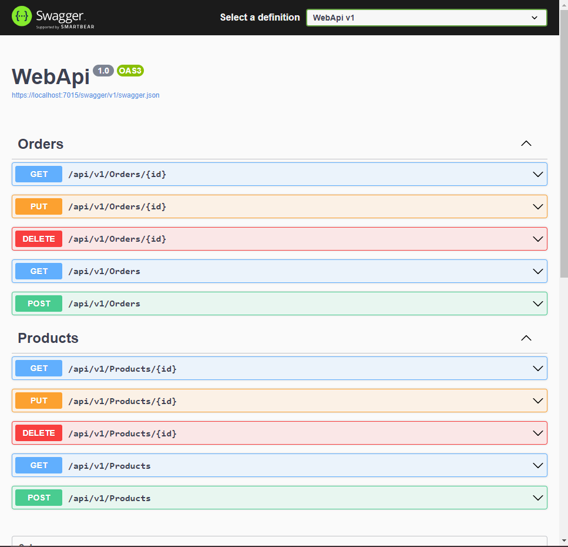

# Clean Architecure App

## Description

This is a project that aims to be a sample of a demo of the Clean Architecture.

## Table of Contents

- [Installation](#installation)
- [Usage](#usage)
- [Contributing](#contributing)
- [License](#license)
- [Contact](#contact)

## Installation

To install and run this project, follow these steps:

1. Clone the repository.
2. Navigate to the project directory.
3. Install the dependencies by running the following command: `dotnet restore`

## Libraries

- [AutoMapper] : For Mapping Objects
- [MediatR] : For CQRS
- [EntityFrameworkCore] : For ORM
- [Swashbuckle]: For Swagger Documentation
- [Serilog] : For Logging
- [Serilog.Sinks.File] : For logging to file
- [Serilog.Sinks.Console] : For Logging to Console
- [Asp.Versioning.Mvc.ApiExplorer] : For API Versioning

## Usage

To use this project, follow these steps:

1. Copy the connection string of your Database to appSetting.json file
2. In "Clean Architecture App\Infrastructure" folder run the following command: `dotnet ef database update`
3. Build the Sln in Visual Studio or Run `dotnet build`, then `dotnet run`
4. Run WebApi Project
5. You'll be greeted with a Swagger Documentation of the API like shown below: 
				
	

## Contributing

Contributions are welcome! If you would like to contribute to this project, please follow these guidelines:

1. Fork the repository.
2. Create a new branch.
3. Make your changes.
4. Commit your changes.
5. Push to the branch.
6. Submit a pull request.

## License

This project is licensed under the [MIT License](LICENSE).
